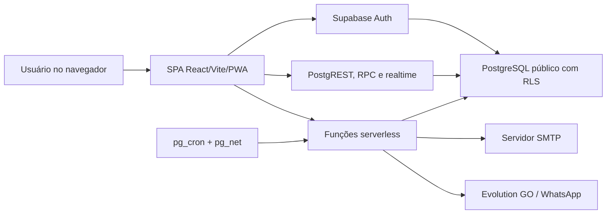

# Inventário do Projeto Atual — MesaChef

## 1. Metadados

| Campo | Valor |
|---|---|
| Spec relacionada | SPEC 000 |
| Data de corte | 2026-07-18 |
| Método | análise estática, somente leitura |
| Caminho configurado | `../mesachef-reference` — não encontrado |
| Caminho localizado | `../mesachef-migration/mesachef-reference` |
| Estado Git da referência | `main`, sem alterações locais no momento da inspeção |
| Dados reais acessados | não |
| Secrets ou `.env` acessados | não |
| Aplicação executada | não |

Este inventário registra evidências funcionais, visuais e comportamentais. Ele não autoriza reutilização literal de código, SQL, migrations, funções serverless ou estrutura interna.

## 2. Resumo executivo

O sistema atual é uma SPA criada com Lovable, React, Vite e Supabase. O navegador concentra consultas, mutações, cálculos e parte da orquestração de processos; Supabase fornece autenticação, PostgREST, RPC, PostgreSQL com RLS e funções serverless.

Contagens observadas:

- 29 arquivos de página em `src/pages`;
- 28 rotas explícitas e uma rota curinga;
- 21 hooks de aplicação/dados em `src/hooks`;
- 33 tabelas no schema público representadas nos tipos gerados;
- 63 migrations SQL versionadas no projeto de referência;
- 7 funções serverless, além de um helper compartilhado de CORS;
- 50 componentes de UI base em `src/components/ui`;
- 1 teste de exemplo, sem suíte funcional representativa observada;
- suporte a PWA, tema claro/escuro e aviso de conectividade.

O produto observado já cobre estoque, compras, fornecedores, cálculos de produção, fichas técnicas, precificação, CMV, self-service, visão executiva, empresas, usuários, auditoria, e-mail e WhatsApp. A maturidade é desigual: há fluxos completos de interface, tabelas sem uso visível, regras críticas no cliente, políticas RLS que evoluíram ao longo de muitas migrations e operações compostas sem uma fronteira transacional única.

## 3. Arquitetura observada

Características:

- uma única aplicação frontend implantável;
- inexistência de API própria para operações de negócio;
- acesso direto do frontend a tabelas e RPCs do Supabase;
- funções serverless usadas para operações privilegiadas e integrações;
- regras de autorização divididas entre menu, páginas, RLS e funções;
- regras de cálculo em hooks, utilitários e páginas React;
- banco compartilhado entre módulos, com `company_id` e RLS introduzidos gradualmente;
- jobs de WhatsApp disparados por extensões específicas de PostgreSQL/Supabase.

## 4. Estrutura relevante do repositório antigo

| Área | Conteúdo observado | Uso no inventário |
|---|---|---|
| `src/pages` | 29 páginas | telas, fluxos, filtros e ações |
| `src/components/layout` | layout e sidebar | menus, responsividade e visibilidade por papel |
| `src/components/pricing` | formulários e resultados de preço | fichas, premissas e cálculo |
| `src/components/calculators` | fator de correção e cocção | regras de produção e aplicação a estoque |
| `src/hooks` | acesso direto ao Supabase e cálculos | entidades, operações e efeitos colaterais |
| `src/utils` | CMV, valoração, unidades e exportação | fórmulas e normalização |
| `src/integrations/supabase` | client e tipos gerados | inventário do schema público |
| `supabase/migrations` | 63 migrations | tabelas, RLS, triggers, functions e extensões |
| `supabase/functions` | 7 funções serverless | identidade privilegiada, SMTP e WhatsApp |
| `mem/features` | nota de integração WhatsApp | intenção atual e artefatos legados |
| `public` | logotipo e assets PWA | identidade visual e instalação |

Arquivos de credencial, variáveis de ambiente e dados persistidos ficaram fora da inspeção.

## 5. Stack observada

| Camada | Tecnologias principais | Observação de migração |
|---|---|---|
| Frontend | React 18, TypeScript, Vite 5 | referência de experiência, não de implementação |
| UI | Tailwind CSS, shadcn/ui, Radix UI, Lucide | identidade e padrões podem ser reinterpretados |
| Estado remoto | TanStack Query | comportamento de cache precisa ser revisto para a API própria |
| Formulários | React Hook Form e Zod em partes do sistema | validação é inconsistente entre fluxos |
| Gráficos | Recharts | relatórios e dashboards usam visualizações no cliente |
| Datas/exportação | date-fns e utilitários próprios | exportações observadas em CSV/XLSX compatível e relatórios |
| Backend atual | Supabase Auth, PostgREST, RPC e Edge Functions | será substituído por API própria e adapters |
| Banco atual | PostgreSQL gerenciado pelo Supabase | schema e dados exigem transformação, não cópia literal |
| PWA | `vite-plugin-pwa` e Workbox | instalação e cache limitado; offline completo não foi observado |
| Testes | Vitest e Testing Library configurados | apenas teste de exemplo foi localizado |

## 6. Capacidades funcionais observadas

| Área | Capacidades evidenciadas | Estado observado | Evidência principal |
|---|---|---|---|
| Autenticação | login, logout, recuperação e redefinição de senha, status ativo e expiração | ativa, com lacunas de política | `Auth.tsx`, `ResetPassword.tsx`, AuthContext e funções de senha |
| Empresas | cadastro, edição e ativação/inativação | ativa para superadmin | `Companies.tsx` |
| Usuários e papéis | criação, edição, ativação, papel, empresa e reset administrativo | ativa | `Users.tsx` e funções `create-user`, `update-user`, `reset-user-password` |
| Estoque | categorias, itens, saldo, mínimo, validade, responsável, unidade e embalagem | ativa | `Dashboard.tsx`, `useStockData.ts` |
| Contagem | preenchimento em lote, data, validade, descarte e resumo | ativa | `StockEntry.tsx` |
| Alertas | sem estoque, estoque baixo e vencimento | ativa no cliente | dashboards, sidebar e `useSettings.ts` |
| Valoração | valor total, por categoria, itens relevantes e tendência | ativa | `StockValuation.tsx`, helpers de valoração |
| Fornecedores | CRUD e ativação | ativa | `Suppliers.tsx` |
| Compras avulsas | lançamento, edição, exclusão, fornecedor e atualização de saldo/custo | ativa, não transacional | `StockPurchases.tsx`, `useStockPurchases.ts` |
| Ordens de compra | cabeçalho, múltiplos itens, embalagem, custo base e entrada de estoque | ativa, com compensação incompleta | dialog e `useStockPurchaseOrders.ts` |
| Ajustes | divergência teórico x físico, causa, impacto e atualização do saldo | ativa | `StockAdjustments.tsx`, `useStockAdjustments.ts` |
| Calculadoras | fator de correção, fator de cocção, histórico e aplicação a insumo | ativa | `Calculators.tsx`, componentes de calculadora |
| Produtos de venda | produto, categoria, unidade, status e pesquisa | ativa | `PricingProducts.tsx` |
| Fichas técnicas | ingredientes de estoque, ficha composta, rendimento, mão de obra e embalagem | ativa | `TechnicalSheetPage.tsx`, componentes de pricing |
| Configuração de preço | custos fixos/variáveis, percentuais globais e overrides por produto | ativa | `PricingConfig.tsx`, `GlobalConfigForm.tsx` |
| Precificação | preço sugerido, mínimo, CMV, margem, lucro e status | ativa, fórmula no cliente | `usePricingData.ts` |
| Revenda | custo de aquisição/embalagem, preço sugerido/praticado e viabilidade | ativa | `PricingResale.tsx`, `usePricingResale.ts` |
| Relatórios de preço | indicadores, gráficos, alertas, categoria e exportação | ativa | `PricingReports.tsx` |
| CMV | visão por período, produtos/categorias e indicadores | ativa | `CMVDashboard.tsx` |
| Snapshots de CMV | geração, histórico, notas e exclusão | ativa | `CMVSnapshots.tsx`, hook correspondente |
| Self-service | fechamento diário, receitas, produção, sobra, consumo, vendas, histórico e dashboard | ativa | `SelfService.tsx` |
| Visão executiva | estoque, compras, perdas, CMV, preço, self-service e alertas | ativa | `CentralLucro.tsx` |
| Auditoria | consulta, filtros e exportação; criação por RPC em parte dos fluxos | parcial | `AuditLog.tsx`, `useAuditLog.ts` |
| Configurações | alertas de estoque e configuração SMTP global | ativa, escopo misto | `useSettings.ts`, `Settings.tsx` |
| WhatsApp | preferências por empresa, envio manual, teste, agenda e relatório | ativa | `WhatsAppConfig.tsx`, funções de WhatsApp |
| WhatsApp global | credenciais e teste do provedor | ativa para superadmin | `WhatsAppGlobalConfig.tsx` |
| Monitor WhatsApp | sucesso, falha, empresas afetadas e tentativas | ativa para superadmin | `WhatsAppMonitor.tsx` |
| Página de confiança | texto público sobre segurança e privacidade | editorial, não comprobatório | `Trust.tsx` |
| PWA | instalação, atualização automática e aviso offline | ativa | Vite/PWA, manifest e componentes PWA |

O detalhamento e as hipóteses estão em `mapa-funcionalidades.md`.

## 7. Autenticação, autorização e multiempresa

### 7.1 Modelo observado

- autenticação por e-mail e senha no Supabase Auth;
- papéis `superadmin`, `admin` e `staff` em `user_roles`;
- vínculo do usuário com empresa em `profiles.company_id`;
- priorização do maior papel no cliente quando há múltiplos registros;
- `company_id` resolvido por profile em hooks e funções privilegiadas;
- RLS habilitada nas 33 tabelas públicas observadas;
- helpers de banco para papel, empresa atual, usuário ativo e preenchimento de tenant;
- funções serverless autenticam o JWT e usam service role após autorizar o chamador.

### 7.2 Lacunas e riscos observados

- a visibilidade do menu não é uma fronteira de segurança;
- diversas rotas marcadas como admin no menu possuem apenas guarda de autenticação na página;
- algumas ações administrativas são renderizadas para usuário autenticado e dependem de falha da RLS;
- a rota raiz redireciona qualquer usuário autenticado para a “Central de Lucro”, embora o menu a marque como admin;
- regras estão distribuídas entre cliente, policies e funções, dificultando provar a matriz efetiva;
- muitos `company_id` do schema gerado ainda são anuláveis por evolução histórica;
- `user_roles` não possui `company_id` próprio e depende do vínculo em profile;
- conta inativa é verificada após autenticação no cliente; a aplicação consistente no backend precisa ser comprovada;
- não foi localizado rate limiting próprio para login ou recuperação de senha;
- a senha mínima observada em alguns fluxos é de seis caracteres, enquanto a página pública fala em “senha forte”;
- a tabela `password_history` existe, mas não foi localizado fluxo que grave ou confira as últimas senhas.

Conclusão: a RLS demonstra intenção de isolamento, mas o novo sistema deve reconstruir e testar a autorização no backend, sem transportar policies ou confiar no comportamento de UI.

## 8. Dados, regras e transações observadas

### 8.1 Estoque e compras

- o saldo é mantido em `stock_items.current_quantity`;
- o custo atual é mantido em `stock_items.value`;
- compras avulsas somam quantidade ao saldo e substituem o custo atual pelo custo informado;
- ordens de compra convertem unidade de compra para unidade base usando tamanho de embalagem;
- edição de compra avulsa tenta ajustar o delta de quantidade;
- exclusão de compra avulsa não apresenta estorno do saldo no fluxo inspecionado;
- exclusão de ordem de compra não apresenta estorno dos itens vinculados;
- criação de ordem, criação de itens e atualização de estoque ocorrem em chamadas sequenciais do cliente;
- falha na inserção dos itens pode deixar o cabeçalho criado;
- contagem em lote executa várias atualizações paralelas e registra auditoria depois do conjunto;
- ajustes físicos substituem o saldo pelo valor contado.

Esses comportamentos são evidência do legado, não decisão do novo domínio.

### 8.2 Dinheiro, percentuais e unidades

- o banco usa `DECIMAL/NUMERIC`, com escalas explícitas apenas em parte das colunas;
- o cliente converte valores para `number` e faz cálculos em JavaScript;
- custo, preço, quantidade, peso e percentual compartilham frequentemente o tipo `number`;
- a entrada decimal varia entre ponto e vírgula nas telas;
- o parser das calculadoras remove pontos antes de interpretar o número, podendo converter uma entrada decimal com ponto em valor cem vezes maior;
- estoque antigo usa `unit`; evolução posterior adicionou `base_unit`, `count_unit` e `package_size`;
- fichas aceitam massa, volume, unidade e porção, com conversões específicas;
- arredondamento e escala de persistência não estão centralizados.

### 8.3 Fórmulas observadas

- CMV teórico: estoque inicial + compras − estoque final;
- snapshot pode assumir CMV real igual ao teórico quando o valor real não é informado;
- valoração normaliza gramas para quilos e mililitros para litros antes de aplicar custo base;
- precificação considera custo da ficha, mão de obra, embalagem e percentuais de despesa, lucro e investimento;
- revenda considera aquisição, embalagem, despesas e lucro desejado;
- self-service calcula produção, consumo, sobra, vendas, custo consumido, CMV estimado e resultado.

Todas as fórmulas permanecem “Hipótese funcional — necessita validação” até aprovação nas specs de domínio.

## 9. Banco e persistência

O schema público possui 33 tabelas, todas com RLS habilitada nas migrations observadas. Além delas, há dependência de `auth.users` do Supabase.

Grupos principais:

- identidade/tenancy/auditoria: 5 tabelas;
- configurações e secrets técnicos: 2 tabelas;
- estoque e produção: 5 tabelas;
- fornecedores e compras: 4 tabelas;
- produtos, fichas e precificação: 9 tabelas;
- CMV, ajustes e self-service: 4 tabelas;
- WhatsApp: 4 tabelas.

Recursos específicos observados:

- enums PostgreSQL;
- RLS e policies permissivas/restritivas;
- functions `SECURITY DEFINER` com `search_path` explícito;
- triggers de auditoria, tenant, atualização e histórico;
- arrays para destinatários e dias de semana;
- colunas numéricas geradas em itens de ordem de compra;
- extensões `pg_cron` e `pg_net`;
- referências a `auth.users`;
- agendamento em fuso `America/Sao_Paulo` na integração WhatsApp.

O mapa detalhado está em `mapa-banco-dados.md`.

## 10. Integrações externas

| Integração | Uso observado | Credencial | Tratamento recomendado |
|---|---|---|---|
| Supabase Auth | sessão, usuários, recuperação e admin API | anon key e service role no servidor | substituir por adapter de identidade; não migrar segredo |
| PostgREST/RPC | acesso a tabelas e auditoria | token do usuário | substituir por API própria |
| SMTP | teste e recuperação de senha | senha por variável de ambiente | reprovisionar em cofre/ambiente |
| Evolution GO | teste e envio de mensagens | API key global no servidor/banco protegido | adapter; decidir provedor e reprovisionar segredo |
| `pg_cron`/`pg_net` | disparo do runner de WhatsApp | secret técnico | substituir ou encapsular em job interno; reprovisionar segredo |
| Google Fonts | fonte Inter | acesso web externo | avaliar self-hosting, privacidade e disponibilidade |

Nenhum valor de credencial foi coletado.

## 11. WhatsApp observado

- configuração global de provedor acessível apenas por função privilegiada de superadmin;
- preferências por empresa: habilitação, destinatários, agenda, frequência e filtros de estoque;
- frequências por intervalo, hora, dia, semana e mês;
- runner executado a cada cinco minutos no desenho atual;
- registro de tentativas sem conteúdo integral da mensagem;
- destino armazenado de forma mascarada nos logs;
- tabela de credenciais por empresa declarada como legado e não mais lida;
- colunas antigas de URL/instância permanecem na configuração por empresa, mas não são usadas segundo a nota funcional;
- integração global desabilitada ou incompleta gera falha operacional registrada.

A decisão global versus por tenant e a continuidade do Evolution GO ainda precisam de aprovação.

## 12. Experiência visual e navegação

Características observadas:

- layout responsivo com sidebar escura, recolhível e menu agrupado;
- navegação móvel com abertura/fechamento da sidebar;
- tema claro e escuro persistido localmente;
- fonte Inter;
- cartões, tabelas, abas, diálogos, badges, gráficos e toasts;
- azul corporativo como cor principal da interface;
- verde, amarelo e vermelho para sucesso, atenção, estoque baixo e vencimento;
- logotipo “MesaChef Sistema” em laranja, preto e branco;
- divergência perceptível entre a paleta do logotipo e a paleta azul da aplicação;
- valores monetários apresentados em `pt-BR` em grande parte das telas;
- tabelas extensas e edição inline em fluxos operacionais;
- indicador offline e convite de instalação PWA.

O novo design deve preservar fluxos úteis e reconhecimento da marca sem copiar componentes ou CSS. A direção visual será definida na SPEC 003.

## 13. PWA e comportamento offline

- manifest e ícones para instalação estão presentes;
- service worker usa atualização automática;
- assets estáticos são pré-cacheados;
- chamadas ao domínio Supabase são configuradas com estratégia `NetworkFirst` e cache temporário;
- o usuário recebe aviso quando fica offline;
- não foi observado mecanismo completo de fila de mutações, resolução de conflito ou operação offline de negócio.

Portanto, “PWA instalável” e “operação offline completa” são capacidades diferentes. A segunda permanece fora do escopo inicial.

## 14. Qualidade, testes e observabilidade

### Pontos positivos observados

- TypeScript e lint configurados;
- TanStack Query e Zod usados em partes do produto;
- RLS habilitada em todas as tabelas públicas inventariadas;
- CORS compartilhado com allowlist;
- `search_path` explícito em funções privilegiadas relevantes;
- auditoria e histórico presentes em vários fluxos;
- erros de recuperação de senha evitam enumerar e-mail na interface;
- logs do WhatsApp evitam armazenar conteúdo da mensagem.

### Lacunas observadas

- apenas um teste de exemplo foi localizado;
- não há evidência de testes E2E dos fluxos críticos;
- não há evidência de testes automatizados de isolamento entre empresas;
- operações compostas não possuem transação única;
- auditoria é chamada pelo cliente em vários fluxos e não cobre comprovadamente todas as ações críticas;
- mensagens técnicas e objetos de erro ainda aparecem em `console.error`;
- nenhuma estratégia completa de idempotência foi identificada;
- não foi localizada instrumentação de correlation ID, métricas ou tracing;
- não foi localizado rate limiting próprio;
- comentários, UI e tabela de histórico de senha fazem claims cuja execução não foi encontrada;
- tipos `any` são usados para contornar divergências dos tipos gerados.

## 15. Artefatos legados, parciais ou sem uso visível

| Artefato | Evidência | Classificação inicial |
|---|---|---|
| `custom_columns` | tabela e policies, sem consumidor localizado em `src` | candidato a descontinuar ou reespecificar |
| `password_history` | tabela protegida, sem gravação/validação localizada | implementação incompleta ou obsoleta |
| `whatsapp_credentials` | nota declara legado e sem leitura | não migrar segredo; arquivar metadado se necessário |
| `whatsapp_config.base_url/instance` | nota declara colunas legadas | eliminar do novo modelo se confirmado |
| enum legado de categoria de produto | coexistência com `product_categories` | transformar e reconciliar |
| compra avulsa e ordem de compra | dois modelos com efeitos semelhantes | unificar conceito ou explicitar casos de uso |
| `settings` chave-valor | mistura alerta operacional e SMTP global | separar por tipo e escopo |
| página `Trust` | afirmações editoriais não comprovadas integralmente | revisar legal e tecnicamente antes de publicar |

## 16. Validação dos ADRs

### ADR 0001 — Monólito modular

Validada. A solução atual tem alto acoplamento entre dados e regras, mas não apresenta drivers que justifiquem microserviços. O caminho mais seguro é reconstruir limites de domínio dentro de uma implantação única.

### ADR 0002 — PostgreSQL 14 e SQLite auxiliar

Validada com ressalva. A referência usa recursos que SQLite não representa. SQLite pode acelerar testes compatíveis, mas não pode validar isolamento, migrations, concorrência, extensions ou semântica final.

### ADR 0003 — API própria

Validada. Acesso direto e orquestração no frontend produzem riscos de autorização, consistência, idempotência e auditoria. A API própria deve ser a fronteira obrigatória.

## 17. Riscos prioritários para a reconstrução

| Risco | Impacto | Probabilidade | Tratamento documental |
|---|---:|---:|---|
| acesso cruzado entre empresas | 3 | 2 | matriz de tenant, constraints e testes negativos |
| erro de saldo por operação parcial ou exclusão | 3 | 3 | caso de uso transacional, movimentos imutáveis e idempotência |
| erro monetário ou decimal | 3 | 3 | Money/Decimal exato, parser único e política de arredondamento |
| migração de dado sem empresa | 3 | 2 | quarentena, reconciliação e bloqueio de carga |
| migração de secrets | 3 | 2 | exclusão do dataset e reprovisionamento |
| fórmula antiga tratada como requisito | 3 | 2 | aprovação de negócio por spec e testes com exemplos dourados |
| claims de segurança incorretos | 3 | 2 | revisão técnica, jurídica e evidência antes de publicação |
| regressão de fluxo operacional | 2 | 3 | mapa de tela, teste de aceitação e piloto por empresa |
| dependência de recurso PostgreSQL em SQLite | 2 | 3 | gate obrigatório em PostgreSQL 14 |

Escala: 1 baixo, 2 médio, 3 alto.

## 18. Limitações deste inventário

- não houve execução da aplicação ou inspeção de sessão autenticada;
- não houve comparação visual pixel a pixel;
- não houve conexão ao banco nem contagem de registros;
- não houve inspeção de produção;
- tipos gerados podem não refletir migrations não aplicadas em algum ambiente;
- policies foram reconstruídas por leitura histórica e precisam de validação em um schema restaurado;
- comentários e documentos internos do legado podem estar desatualizados;
- comportamentos inferidos foram registrados como hipótese e não como requisito.

## 19. Próximas validações necessárias

As decisões e bloqueios estão em `docs/qa/pendencias.md`. Antes da implementação de cada módulo, devem ser validados com o proprietário:

- papéis e permissões por ação;
- unidades, custo de estoque e estornos;
- fórmulas e arredondamentos;
- prioridades do primeiro release;
- tratamento de dados e secrets legados;
- política de exclusão, retenção e auditoria;
- identidade visual e PWA;
- fonte de dados autorizada para a migração.
