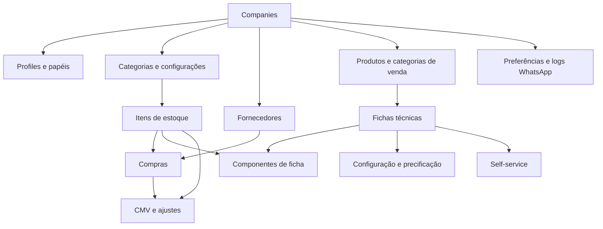

# Mapa do Banco de Dados Atual — Inventário Conceitual

## 1. Escopo e método

Este documento descreve o modelo persistido observado no projeto de referência, sem copiar SQL ou definir o schema da nova plataforma.

Fontes:

- `src/integrations/supabase/types.ts` para o estado tipado do schema público;
- 63 arquivos em `supabase/migrations` para evolução, constraints, RLS, triggers e functions;
- hooks e páginas necessários para entender uso funcional;
- nota de integração em `mem/features/whatsapp-evolution-go.md`.

Limitações:

- nenhum banco foi conectado;
- nenhum registro, volume, valor de secret ou dado pessoal foi lido;
- não foi executado restore das migrations;
- o estado efetivo de cada ambiente pode divergir dos tipos gerados;
- nullabilidade, policies e constraints exigem confirmação em dump autorizado;
- este mapa não é migration nem modelo de destino.

## 2. Visão geral

Foram inventariadas 33 tabelas no schema `public`, todas com habilitação de RLS observada nas migrations. O sistema também depende de `auth.users`, gerenciado pelo Supabase Auth e fora do schema público.

| Grupo | Quantidade | Características |
|---|---:|---|
| Identidade, empresas e auditoria | 5 | usuários externos, vínculo a tenant, papel e trilha |
| Configurações e secrets técnicos | 2 | chave-valor global e secret de cron |
| Estoque e produção | 5 | catálogo, saldo, histórico, campos legados e cálculos |
| Fornecedores e compras | 4 | compra avulsa e ordem multi-item |
| Produtos, fichas e precificação | 9 | produto, composição, premissas e revenda |
| CMV, ajustes e self-service | 4 | snapshots, divergências e fechamento diário |
| WhatsApp | 4 | preferência por tenant, credencial global/legada e logs |
| **Total** | **33** | |

## 3. Identidade, empresas e auditoria

| Tabela atual | Papel observado | Escopo de tenant | Relações principais | Tratamento preliminar |
|---|---|---|---|---|
| `companies` | raiz de empresa cliente | global; cada linha é um tenant | referenciada por vários contextos | migrar após saneamento de identidade/documento e estado |
| `profiles` | perfil operacional do usuário | `company_id` anulável | `auth.users` por `user_id`; `companies` | migrar identidade descritiva; remapear usuário do novo provedor |
| `user_roles` | atribuição de `admin`, `staff` ou `superadmin` | indireto via profile | `auth.users`; unicidade usuário/papel | transformar para grants por empresa/ação; não confiar em múltiplos papéis sem regra |
| `password_history` | hashes históricos de senha | global por usuário | `auth.users` | não migrar automaticamente; enforcement atual não comprovado e hashes são sensíveis |
| `audit_logs` | trilha de ações | `company_id` anulável | referência lógica a usuário e entidade | migrar somente se retenção exigir; validar integridade, PII e imutabilidade |

Observações:

- superadmin é papel global, enquanto admin e staff dependem do profile da empresa;
- vários fluxos assumem um único profile por usuário;
- `company_id` anulável pode representar superadmin, dado histórico não classificado ou falha de backfill; esses casos não podem ser tratados como equivalentes;
- IDs do Supabase Auth não precisam ser preservados como identidade interna do novo sistema; um mapa de IDs auditável é necessário.

## 4. Configurações e secrets técnicos

| Tabela atual | Papel observado | Escopo | Relações | Tratamento preliminar |
|---|---|---|---|---|
| `settings` | chave-valor para alertas e metadados SMTP | global | sem FK observada | separar em configurações tipadas globais e por empresa; classificar sensibilidade |
| `cron_secrets` | segredo usado pelo runner agendado | global, service role | sem FK | não exportar no dataset; reprovisionar em cofre/ambiente e rotacionar |

Risco: a mesma tabela `settings` combina preferências operacionais e configuração de infraestrutura. O destino não deve manter um contêiner genérico sem responsabilidade e sem escopo explícito.

## 5. Estoque e produção

| Tabela atual | Papel observado | Escopo de tenant | Relações principais | Tratamento preliminar |
|---|---|---|---|---|
| `categories` | categoria de insumo | `company_id` anulável | `companies`; referenciada por `stock_items` | migrar por empresa; deduplicar nomes conforme regra aprovada |
| `custom_columns` | definição de coluna dinâmica | `company_id` anulável | sem relação tipada relevante | quarentena; nenhum consumidor de UI foi localizado |
| `stock_items` | cadastro e saldo atual de insumo | `company_id` anulável | categoria, empresa e usuário responsável | migrar cadastro e saldo inicial reconciliado; normalizar unidades |
| `stock_history` | histórico de mudança de quantidade | `company_id` anulável | `stock_items`, empresa e ator lógico | avaliar migração histórica; preferir movimentos imutáveis no destino |
| `production_calculations` | histórico de fator de correção/cocção | `company_id` obrigatório | empresa, item vinculado e cálculo de origem | migrar somente se houver valor operacional; validar fórmulas e escalas |

Campos conceituais relevantes de `stock_items`:

- identidade, nome, categoria e estado ativo;
- quantidade atual e estoque mínimo;
- custo/valor unitário;
- unidade antiga (`unit`);
- unidade base, unidade de contagem e tamanho da embalagem;
- datas de contagem e validade;
- usuário responsável.

Riscos de modelagem:

- `value` é usado como custo por unidade base em alguns fluxos, mas isso não é protegido por tipo;
- quantidade atual mistura legado e modelo de embalagem;
- saldo mutável é fonte direta de verdade, enquanto histórico é derivado por trigger;
- hard delete e inativação coexistem;
- escalas antigas de quantidade usam duas casas, mas fichas e compras posteriores admitem maior precisão.

## 6. Fornecedores e compras

| Tabela atual | Papel observado | Escopo de tenant | Relações principais | Tratamento preliminar |
|---|---|---|---|---|
| `suppliers` | cadastro de fornecedor | `company_id` obrigatório | vínculo lógico com empresa; compras | migrar por empresa; validar CNPJ, contato, duplicidade e estado |
| `stock_purchases` | compra avulsa de um item | `company_id` anulável | item de estoque, fornecedor e empresa | migrar como compra legada ou transformar em ordem de uma linha |
| `stock_purchase_orders` | cabeçalho de compra | `company_id` anulável | fornecedor e itens | migrar cabeçalho após fornecedor; reconciliar total |
| `stock_purchase_order_items` | linha de ordem | `company_id` anulável | ordem e item de estoque | migrar após cabeçalho/item; recalcular campos gerados para conferência |

Dados relevantes:

- fornecedor atual e snapshot do nome;
- data da compra, nota fiscal e observações;
- quantidade comprada, unidade comercial, tamanho da embalagem e unidade base;
- custo por embalagem, custo base, quantidade base e total;
- criador e timestamps.

Riscos:

- dois modelos de compra coexistem;
- efeitos no estoque são realizados pelo cliente, não por transação única;
- exclusões não demonstram estorno de saldo;
- custo atual do item é substituído, sem política clara de média ponderada;
- nome do fornecedor duplicado na compra pode ser snapshot útil ou redundância acidental;
- `company_id` do item de ordem precisa ser comprovadamente igual ao da ordem e do insumo.

## 7. Produtos, fichas técnicas e precificação

| Tabela atual | Papel observado | Escopo de tenant | Relações principais | Tratamento preliminar |
|---|---|---|---|---|
| `product_categories` | categoria customizada de produto | `company_id` obrigatório | empresa; produtos | migrar e reconciliar com enum legado |
| `pricing_products` | produto vendido | `company_id` anulável | empresa e categoria customizada | migrar cadastro; transformar categoria legada |
| `technical_sheets` | ficha técnica do produto | `company_id` anulável | produto e empresa | migrar após produtos; decidir versionamento e imutabilidade |
| `technical_sheet_ingredients` | componente da ficha | `company_id` anulável | ficha, insumo ou ficha vinculada | migrar por grafo acíclico; validar unidade e custo calculado |
| `pricing_config_global` | premissas globais da empresa | `company_id` obrigatório | empresa | migrar como política versionada; validar percentuais |
| `pricing_config_product` | override de premissas | `company_id` anulável | produto e empresa | migrar apenas overrides explícitos e consistentes |
| `pricing_fixed_costs` | despesa fixa detalhada | `company_id` obrigatório | empresa | migrar; reconciliar soma com configuração global |
| `pricing_variable_costs` | despesa variável detalhada | `company_id` obrigatório | empresa | migrar; reconciliar soma e escala percentual |
| `pricing_resale_products` | produto de revenda e simulação | `company_id` obrigatório | item de estoque opcional | migrar se aprovado; custo vinculado pode ser recalculado |

Conceitos numéricos observados:

- custo da ficha, mão de obra por hora, tempo e embalagem;
- rendimento em quilos e porções;
- preço praticado e base de preço (`unit`, `kg`, `portion`);
- despesas variáveis/fixas, lucro, investimento e limiares;
- receita mensal e custos fixos detalhados;
- aquisição, embalagem e lucro desejado da revenda.

Riscos:

- enum legado de categoria e tabela customizada coexistem;
- custos calculados são persistidos e também recalculados no cliente;
- ficha composta depende de prevenção de ciclos no banco;
- não há versão explícita da ficha/custo usada por um fechamento histórico;
- escalas e arredondamentos variam entre colunas;
- unicidades históricas precisam ser reinterpretadas no contexto da empresa;
- totais percentuais inválidos são tratados em parte no banco e em parte no cliente.

## 8. CMV, ajustes e self-service

| Tabela atual | Papel observado | Escopo de tenant | Relações principais | Tratamento preliminar |
|---|---|---|---|---|
| `cmv_snapshots` | fotografia de CMV por período | `company_id` anulável | empresa e criador lógico | migrar somente snapshots reconciliáveis; preservar premissas |
| `stock_adjustments` | divergência teórico x físico | `company_id` anulável | item, snapshot e empresa | transformar em movimento/ajuste auditável; definir estorno |
| `self_service_daily_records` | cabeçalho e totais do fechamento | `company_id` obrigatório | vínculo lógico à empresa e usuário | migrar por empresa/data; validar unicidade e totais |
| `self_service_daily_items` | receita/linha do fechamento | `company_id` obrigatório | fechamento diário | migrar após cabeçalho; recalcular percentuais para conferência |

`cmv_snapshots` armazena estoque inicial, compras, estoque final, CMV teórico/real, diferença, percentual, estado, período e notas.

`self_service_daily_records` armazena simultaneamente entradas e valores derivados: planejamento, refeições reais, consumo médio, produção, consumo, sobra, custo, venda, CMV e resultado. Os itens repetem totais e participações por receita.

Riscos:

- snapshot pode registrar CMV “real” igual ao teórico quando não informado;
- exclusão de snapshot e ajuste pode comprometer trilha histórica;
- totais do self-service podem divergir das linhas;
- atualização do fechamento apaga e recria linhas em chamadas separadas;
- não há referência explícita à versão da ficha importada;
- datas de negócio e timezone precisam ser formalizados.

## 9. WhatsApp

| Tabela atual | Papel observado | Escopo | Relações principais | Tratamento preliminar |
|---|---|---|---|---|
| `whatsapp_config` | preferências de envio | `company_id` obrigatório | vínculo lógico à empresa | migrar preferências aprovadas; remover colunas legadas |
| `whatsapp_credentials` | API key histórica por empresa | tenant, mas bloqueada ao cliente | sem FK tipada | não migrar segredo; tabela declarada legada |
| `whatsapp_global_config` | provedor e credencial global | global singleton | ator de atualização lógico | reprovisionar segredo; migrar apenas metadados não sensíveis se necessário |
| `whatsapp_send_logs` | tentativas de entrega | `company_id` obrigatório | `companies` | migrar somente se retenção operacional exigir; manter destino mascarado |

Preferências observadas:

- habilitação;
- destinatários;
- frequência, horário, intervalo, dias da semana e dia do mês;
- filtros de saúde do estoque;
- último envio para deduplicação.

Credenciais, chaves e secrets nunca devem entrar no arquivo de exportação comum.

## 10. Enums e vocabulário persistido

| Enum observado | Valores | Decisão necessária |
|---|---|---|
| papel | `admin`, `staff`, `superadmin` | manter papéis iniciais e separar permissões por ação |
| tipo de ajuste | perda, quebra, erro operacional | validar taxonomia e necessidade de outros motivos |
| estado CMV | normal, alerta, crítico | validar limiares e se estado deve ser calculado |
| estado de preço | saudável, atenção, inviável | validar nomes e regras |
| categoria legada de produto | café, doce, bolo, combo, salgado, bebida, outro | migrar para catálogo por empresa ou manter sistema híbrido |
| unidade de venda | unidade, fatia, copo, porção, kg, litro | alinhar com modelo geral de unidades |

Strings adicionais funcionam como enums informais: origem/tipo/status de WhatsApp, frequência, unidade de ingrediente, tipo de componente e base de precificação. O destino deve usar tipos explícitos quando reduzirem estados inválidos.

## 11. Funções, triggers e automações observadas

### Funções públicas representadas nos tipos

- criação segura de evento de auditoria;
- resolução da empresa corrente;
- verificação de papel;
- verificação de admin, superadmin e usuário ativo;
- verificação de credencial WhatsApp.

### Funções e triggers adicionais nas migrations

- atualização automática de `updated_at`;
- criação de profile após usuário do Auth;
- preenchimento de `company_id` em inserts;
- histórico de alterações de estoque;
- prevenção de alteração indevida por staff;
- prevenção de autoelevação de profile/papel;
- prevenção de ciclo entre fichas técnicas;
- seed de categorias e configuração padrão por empresa;
- proteção e preenchimento de empresa na auditoria;
- execução agendada do WhatsApp.

Esses mecanismos revelam invariantes e riscos, mas não serão copiados. Cada regra deve ser atribuída ao domínio, aplicação, repository ou infraestrutura apropriada na nova arquitetura.

## 12. RLS e isolamento observado

### Cobertura

Habilitação de RLS foi localizada para todas as 33 tabelas públicas. As policies finais aparentes incluem:

- leitura e administração global por superadmin em empresas, profiles e papéis;
- isolamento por empresa para cadastros operacionais;
- leitura ampla autenticada e escrita admin em vários módulos;
- escrita limitada de quantidade por staff em estoque;
- auditoria sem insert/update/delete direto do cliente;
- acesso somente service role a secrets e credenciais;
- logs de WhatsApp somente leitura para superadmin e sem escrita client-side.

### Por que isso não é prova suficiente

- policies foram recriadas e substituídas ao longo de muitas migrations;
- funções `SECURITY DEFINER` alteram o modelo de confiança;
- `company_id` anulável pode criar casos especiais;
- algumas relações de empresa são lógicas, sem FK tipada aparente;
- a interface ainda faz filtros e guardas próprias;
- não foram executados testes com duas empresas em um schema restaurado.

Na nova solução, isolamento deve ser garantido por contexto autenticado, filtros obrigatórios nos repositories, constraints quando aplicáveis, autorização de casos de uso e testes negativos.

## 13. Dinheiro, quantidade e precisão

### Estado observado

- algumas colunas antigas usam `DECIMAL(10,2)` para custo e quantidade;
- fichas usam precisões como 12,2 e 12,4;
- percentuais usam escalas 5,2 ou 7,4 em partes do schema;
- várias colunas posteriores usam `NUMERIC` sem precisão definida;
- código TypeScript representa todos esses valores como `number`;
- campos gerados calculam quantidade total, custo total e custo base de compras;
- arredondamento não é centralizado.

### Diretriz de destino

- Money usa decimal exato ou centavos, conforme ADR/spec futura;
- percentual possui escala e modo de arredondamento explícitos;
- quantidade e peso possuem escala coerente com unidade;
- valores derivados guardam versão de fórmula/premissas quando históricos;
- entrada aceita vírgula ou ponto por parser único e testado;
- reconciliação compara valores antes e depois do arredondamento aprovado;
- PostgreSQL 14 valida constraints e precisão final.

## 14. Dependências e ordem conceitual de carga

Ordem preliminar de carga:

1. empresas;
2. mapa de usuários, profiles e permissões;
3. configurações não sensíveis e categorias;
4. itens de estoque e saldo inicial reconciliado;
5. fornecedores;
6. compras e linhas;
7. produtos e categorias de venda;
8. fichas e componentes em ordem topológica;
9. políticas/configurações de preço;
10. snapshots, ajustes e self-service;
11. preferências e, se exigido, logs de integração;
12. auditoria histórica aprovada.

Secrets são reprovisionados fora dessa ordem.

## 15. Classificação preliminar de migração

| Classe | Exemplos | Regra |
|---|---|---|
| Migrar como fonte | empresas, profiles, categorias, itens, fornecedores, produtos | limpar, mapear IDs e preservar tenant |
| Migrar após reconciliação | compras, movimentos/histórico, fichas, fechamentos | validar relações, totais e semântica |
| Recalcular e comparar | totais de compra, custos de ficha, preço sugerido, CMV, percentuais self-service | fonte e fórmula aprovadas prevalecem; divergências viram relatório |
| Reprovisionar | senha, SMTP password, API key WhatsApp, cron secret | não transportar em exportação comum |
| Quarentenar/decidir | custom columns, password history, credencial WhatsApp legada, campos antigos | não carregar até decisão explícita |
| Arquivar conforme retenção | logs antigos e auditoria | dataset separado, acesso restrito e prazo definido |

## 16. Regras de qualidade antes da carga

- todo registro tenant-owned possui empresa válida;
- referências não cruzam empresas;
- não há usuário admin/staff sem empresa, salvo decisão explícita;
- nomes e documentos de empresa duplicados são resolvidos;
- categorias, produtos, fornecedores e itens duplicados são classificados;
- unidades e tamanhos de embalagem são convertíveis ou entram em quarentena;
- quantidades e valores respeitam domínio e precisão aprovados;
- compras conciliam cabeçalho, linhas, total e efeito de estoque;
- fichas não possuem ciclos nem componentes órfãos;
- percentuais de preço respeitam limites;
- fechamentos self-service conciliam cabeçalho e linhas;
- nenhum secret, token ou hash aparece no lote comum;
- logs e dados pessoais seguem retenção e minimização aprovadas.

## 17. Reconciliação mínima

Por empresa e módulo:

- contagem de registros extraídos, aceitos, rejeitados e carregados;
- total monetário nas escalas de origem e destino;
- saldo por item e valor total do estoque;
- compras por período e fornecedor;
- quantidade de produtos, fichas e componentes;
- detecção de ciclos e órfãos;
- totais de CMV e self-service por período;
- usuários por papel e estado;
- tentativas explícitas de acesso cruzado entre duas empresas;
- amostra funcional aprovada pelo proprietário do dado.

Checksums ou hashes podem apoiar integridade do lote, mas não substituem reconciliação semântica.

## 18. Pendências que bloqueiam o modelo de destino

- significado e obrigatoriedade de `company_id` em todos os registros históricos;
- modelo de identidade e estratégia para usuários/senhas;
- política de custo de estoque e estorno de compra;
- catálogo e conversão de unidades;
- precisão e arredondamento por conceito;
- versionamento de ficha e custo histórico;
- definição de CMV real e teórico;
- retenção de auditoria, histórico e logs;
- escopo global versus tenant das configurações;
- destino de artefatos legados e secrets.

Os itens estão detalhados em `docs/qa/pendencias.md`.
